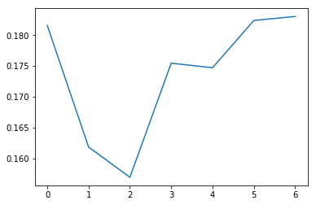
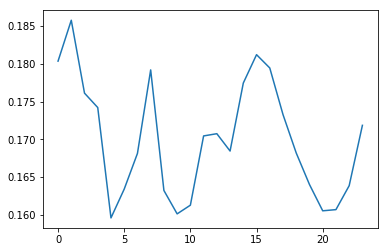

# Click-Through Rate Prediction
Predict CLR with Avazu data using feature engineering and Random Forest


```python
import pandas as pd
import numpy as np
```


p - the model's predicted probability that observation i is of class C

## Metric: AUC
Compute AUC score by hand with the formula explained in class for the following dataset.


```python
d = pd.DataFrame({
        'prediction': [0.1, 0.5, 0.95, 0.99, 0.8, 0.4, 0.03, 0.44, 0.2],
        'y': [1, 0, 1, 1, 1, 1, 0, 0, 0]})
d
```


<div>
<style>
    .dataframe thead tr:only-child th {
        text-align: right;
    }

    .dataframe thead th {
        text-align: left;
    }

    .dataframe tbody tr th {
        vertical-align: top;
    }
</style>
<table border="1" class="dataframe">
  <thead>
    <tr style="text-align: right;">
      <th></th>
      <th>prediction</th>
      <th>y</th>
    </tr>
  </thead>
  <tbody>
    <tr>
      <th>0</th>
      <td>0.10</td>
      <td>1</td>
    </tr>
    <tr>
      <th>1</th>
      <td>0.50</td>
      <td>0</td>
    </tr>
    <tr>
      <th>2</th>
      <td>0.95</td>
      <td>1</td>
    </tr>
    <tr>
      <th>3</th>
      <td>0.99</td>
      <td>1</td>
    </tr>
    <tr>
      <th>4</th>
      <td>0.80</td>
      <td>1</td>
    </tr>
    <tr>
      <th>5</th>
      <td>0.40</td>
      <td>1</td>
    </tr>
    <tr>
      <th>6</th>
      <td>0.03</td>
      <td>0</td>
    </tr>
    <tr>
      <th>7</th>
      <td>0.44</td>
      <td>0</td>
    </tr>
    <tr>
      <th>8</th>
      <td>0.20</td>
      <td>0</td>
    </tr>
  </tbody>
</table>
</div>


```python
d.sort_values(by=["prediction"],ascending=False,inplace=True)
pairs_num = d.groupby('y').count()['prediction'].product()
d['1_b4_0_count'] = np.cumsum(d['y'])
print("AUC =", sum(d[d["y"]==0]["1_b4_0_count"])/pairs_num)
d
```

    AUC = 0.75


<div>
<style>
    .dataframe thead tr:only-child th {
        text-align: right;
    }

    .dataframe thead th {
        text-align: left;
    }

    .dataframe tbody tr th {
        vertical-align: top;
    }
</style>
<table border="1" class="dataframe">
  <thead>
    <tr style="text-align: right;">
      <th></th>
      <th>prediction</th>
      <th>y</th>
      <th>1_b4_0_count</th>
    </tr>
  </thead>
  <tbody>
    <tr>
      <th>3</th>
      <td>0.99</td>
      <td>1</td>
      <td>1</td>
    </tr>
    <tr>
      <th>2</th>
      <td>0.95</td>
      <td>1</td>
      <td>2</td>
    </tr>
    <tr>
      <th>4</th>
      <td>0.80</td>
      <td>1</td>
      <td>3</td>
    </tr>
    <tr>
      <th>1</th>
      <td>0.50</td>
      <td>0</td>
      <td>3</td>
    </tr>
    <tr>
      <th>7</th>
      <td>0.44</td>
      <td>0</td>
      <td>3</td>
    </tr>
    <tr>
      <th>5</th>
      <td>0.40</td>
      <td>1</td>
      <td>4</td>
    </tr>
    <tr>
      <th>8</th>
      <td>0.20</td>
      <td>0</td>
      <td>4</td>
    </tr>
    <tr>
      <th>0</th>
      <td>0.10</td>
      <td>1</td>
      <td>5</td>
    </tr>
    <tr>
      <th>6</th>
      <td>0.03</td>
      <td>0</td>
      <td>5</td>
    </tr>
  </tbody>
</table>
</div>


## Regularized mean (target) encoding for Avazu competition

Implement a version of regularized mean encoding. We will be using the data on this Kaggle [compettion](https://www.kaggle.com/c/avazu-ctr-prediction).  

**Process:**
- Split data (training) into training and validation. Take the last week (7 days) of training set as validation.
- Implement regularized mean encoding for the training set using pandas.
- Implement mean encoding for the validation set


```python
## Split train and validation
# get sample data first
path = "avazu/"
!head -100000 $path/train > $path/train_sample.csv
!head -100000 $path/test > $path/test_sample.csv
data = pd.read_csv(path + "train_sample.csv")
test = pd.read_csv(path + "test_sample.csv")
```


```python
def split_based_hour(data):
    """ Split data based on column hour.

    Use 20% of the date for validation.
    Inputs:
       data: dataframe from avazu
    Returns:
       train:
       val: 20% of the largest values of column "hour".
    """
    N = int(0.8*len(data))
    data = data.sort_values(by="hour")
    train = data[:N].copy()
    val = data[N:].copy()
    return train.reset_index(), val.reset_index()
train, val = split_based_hour(data)
```

### Regularized mean encoding
Here is how you do mean encoding without regularization.


```python
# Calculate a mapping: {device_type: click_mean}
mean_device_type = train.groupby('device_type').click.mean()
mean_device_type
```


    device_type
    0    0.224277
    1    0.176116
    4    0.069777
    5    0.083333
    Name: click, dtype: float64


```python
# This is the global click mean
global_mean = train.click.mean()
global_mean
```


    0.17477718471480894


```python
train["device_type_mean_enc"] = train["device_type"].map(mean_device_type)
val["device_type_mean_enc"] = val["device_type"].map(mean_device_type)
```


```python
train["device_type_mean_enc"].fillna(global_mean, inplace=True)
val["device_type_mean_enc"].fillna(global_mean, inplace=True)
```


```python
# Print correlation
encoded_feature = val["device_type_mean_enc"].values
print(np.corrcoef(val["click"].values, encoded_feature)[0][1])
```

    0.0530389229998


To do mean encoding with K-fold regularization you do the following:

* Run a 5-fold split on train data where `mean_device_type` is computed on 4/5 of the data and the encoding is computed on the other 1/5.
* To compute mean encoding on the validation data use the code similar to encoding without regularization. That is compute on all the training data and apply to the validation set.


```python
from sklearn.model_selection import KFold

def reg_target_encoding(train, col = "device_type", splits=5):
    """ Computes regularize mean encoding.
    Inputs:
       train: training dataframe
    """
    train[col+"_mean_enc"] = np.nan
    kf = KFold(n_splits=splits)
    for trn_ind, val_ind in kf.split(train):
        mean_by_col = train.loc[trn_ind].groupby(col).click.mean()
        train.loc[val_ind, col+"_mean_enc"] = train.loc[val_ind][col].map(mean_by_col)
```


```python
reg_target_encoding(train)
encoded_feature = train["device_type_mean_enc"].values
corr = np.corrcoef(train["click"].values, encoded_feature)[0][1]
assert(np.around(corr, decimals=4) == 0.0551)
```


```python
def mean_encoding_test(test, train, col = "device_type", splits=5):
    """ Computes target enconding for test data.

    This is similar to how we do validation
    """
    reg_target_encoding(train, col = col, splits=splits)
    mean_by_col = train.groupby(col).click.mean()
    test[col+"_mean_enc"] = test[col].map(mean_by_col)
```


```python
mean_encoding_test(test, train)
encoded_feature_mean = test["device_type_mean_enc"].values.mean()
assert(np.around(encoded_feature_mean, decimals=4) == 0.177)
```

## Implement other features and fit a model
* Implement a few more features, include:

   * day of the week and hour
   * mean encoding of some other features (at least two)
   * use plots and `value_counts()` to understand the data


* Fit a random forest (to the whole dataset):

   * Do hyperparameter tunning using your validation set
   * Report test and train log loss


```python
def load_data():
    path = "avazu/"
    data = pd.read_csv(path + "train")
    test = pd.read_csv(path + "test")
    return data, test
```


```python
types = {'id': np.uint32, 'click': np.uint8, 'hour': np.uint32, 'C1': np.uint32, 'banner_pos': np.uint32,
         'site_id': 'category', 'site_domain': 'category', 'site_category': 'category', 'app_id': 'category',
         'app_domain': 'category', 'app_category': 'category', 'device_id': 'category',
         'device_ip': 'category', 'device_model': 'category', 'device_type': np.uint8, 'device_conn_type': np.uint8,
         'C14': np.uint16, 'C15': np.uint16, 'C16': np.uint16, 'C17': np.uint16, 'C18': np.uint16, 'C19': np.uint16,
         'C20': np.uint16, 'C21': np.uint16}

#data = pd.read_csv(path + "train", usecols=types.keys(), dtype=types)
```


```python
data = pd.read_feather("data")
```


```python
print(data.info(memory_usage='deep'))
```

    <class 'pandas.core.frame.DataFrame'>
    RangeIndex: 40428967 entries, 0 to 40428966
    Data columns (total 24 columns):
    id                  uint32
    click               uint8
    hour                uint32
    C1                  uint32
    banner_pos          uint32
    site_id             category
    site_domain         category
    site_category       category
    app_id              category
    app_domain          category
    app_category        category
    device_id           category
    device_ip           category
    device_model        category
    device_type         uint8
    device_conn_type    uint8
    C14                 uint16
    C15                 uint16
    C16                 uint16
    C17                 uint16
    C18                 uint16
    C19                 uint16
    C20                 uint16
    C21                 uint16
    dtypes: category(9), uint16(8), uint32(4), uint8(3)
    memory usage: 3.0 GB
    None


```python
# source: fastai
def add_datepart(df, fldname, drop=True):
    fld = df[fldname]
    if not np.issubdtype(fld.dtype, np.datetime64):
        df[fldname] = fld = pd.to_datetime(fld, infer_datetime_format=True)
    targ_pre = re.sub('[Dd]ate$', '', fldname)
    for n in ('Year', 'Month', 'Week', 'Day', 'Dayofweek', 'Dayofyear',
            'Is_month_end', 'Is_month_start', 'Is_quarter_end', 'Is_quarter_start', 'Is_year_end', 'Is_year_start'):
        df[targ_pre+n] = getattr(fld.dt,n.lower())
    df[targ_pre+'Elapsed'] = fld.astype(np.int64) // 10**9
    if drop: df.drop(fldname, axis=1, inplace=True)
```

### Parse Day of The Week and Hour


```python
import re
```


```python
data['date'] = 2000000000 + data['hour']
data['date'] = pd.to_datetime(data['date'],format='%Y%m%d%H')
add_datepart(data, 'date')
```


```python
data['hour'] = data['hour']%100
```


```python
drop_list = ['id','Year', 'Month', 'Week', 'Day',
             'Dayofyear','Is_month_end', 'Is_month_start', 'Is_quarter_end',
             'Is_quarter_start','Is_year_end', 'Is_year_start', 'Elapsed']
data.drop(drop_list,1,inplace=True)
```

### hash features


```python
hash_list = ['site_id','site_domain','site_category',
             'app_id','app_domain','app_category',
             'device_id','device_ip','device_model']

mod_list = [10007, 10007, 97,
           10007, 997, 97,
           1e7+19, 1e7+19, 10007]

for i,c in enumerate(hash_list):
    data[c] = data[c].map(hash).astype(np.float32)% mod_list[i]

```

## Train Val Split


```python
def split_based_hour(data):
    """ Split data based on column hour.

    Use 20% of the date for validation.
    Inputs:
       data: dataframe from avazu
    Returns:
       train:
       val: 20% of the largest values of column "hour".
    """
    N = int(0.8*len(data))
    train = data[:N].copy()
    val = data[N:].copy()
    return train.reset_index(), val.reset_index()
```


```python
train, val = split_based_hour(data)
```

### Mean Encoding for some features


```python
mean_encoding_test(val, train, col = "device_type")
mean_encoding_test(val, train, col = "Dayofweek")
mean_encoding_test(val, train, col = "banner_pos")
mean_encoding_test(val, train, col = "site_category")
mean_encoding_test(val, train, col = "hour")
```


```python
global_mean = train.click.mean()
train.fillna(global_mean, inplace=True)
val.fillna(global_mean, inplace=True)
```


```python
train.to_featherather('train')
val.to_feather('val')
```

## Plots and Value Counts


```python
%matplotlib inline
import matplotlib.pyplot as plt
```


```python
df = pd.DataFrame({'mean_click_dow' : data["click"].groupby(data['Dayofweek']).mean()}).reset_index()
plt.plot(df.Dayofweek, df.mean_click_dow)
plt.show
```


    <function matplotlib.pyplot.show>





```python
df = pd.DataFrame({'mean_click_dow' : data["click"].groupby(data['hour']).mean()}).reset_index()
plt.plot(df.hour, df.mean_click_dow)
plt.show
```


    <function matplotlib.pyplot.show>





```python
data.Dayofweek.value_counts()
```


    1    9410217
    2    9169734
    3    8089690
    6    3835892
    5    3363122
    4    3335302
    0    3225010
    Name: Dayofweek, dtype: int64


```python
data.banner_pos.value_counts()
```


    0    29109590
    1    11247282
    7       43577
    2       13001
    4        7704
    5        5778
    3        2035
    Name: banner_pos, dtype: int64


## Random Forest


```python
from sklearn.ensemble import RandomForestClassifier
from sklearn.metrics import accuracy_score, log_loss, auc, roc_curve
rf = RandomForestClassifier(n_jobs=-1, min_samples_leaf=10)
```


```python
X_train = train.drop(['click', 'index', 'device_type', 'site_category', 'app_category', 'banner_pos'], axis=1)
y_train = train['click']
X_val = val.drop(['click', 'index', 'device_type', 'site_category', 'app_category', 'banner_pos'], axis=1)
y_val = val['click']
```


```python
rf.fit(X_train, y_train)
```

    CPU times: user 5 µs, sys: 1e+03 ns, total: 6 µs
    Wall time: 20 µs


    RandomForestClassifier(bootstrap=True, class_weight=None, criterion='gini',
                max_depth=None, max_features='auto', max_leaf_nodes=None,
                min_impurity_decrease=0.0, min_impurity_split=None,
                min_samples_leaf=10, min_samples_split=2,
                min_weight_fraction_leaf=0.0, n_estimators=10, n_jobs=-1,
                oob_score=False, random_state=None, verbose=0,
                warm_start=False)


```python
pred_trn = rf.predict_proba(X_train)
pred = rf.predict_proba(X_val)
```


```python
print('Training loss:',log_loss(y_train, pred_trn[:,1]) )
print('Testing loss:',log_loss(y_val, pred[:,1]) )
```

    Training loss: 0.350652430816
    Testing loss: 0.409515728913
