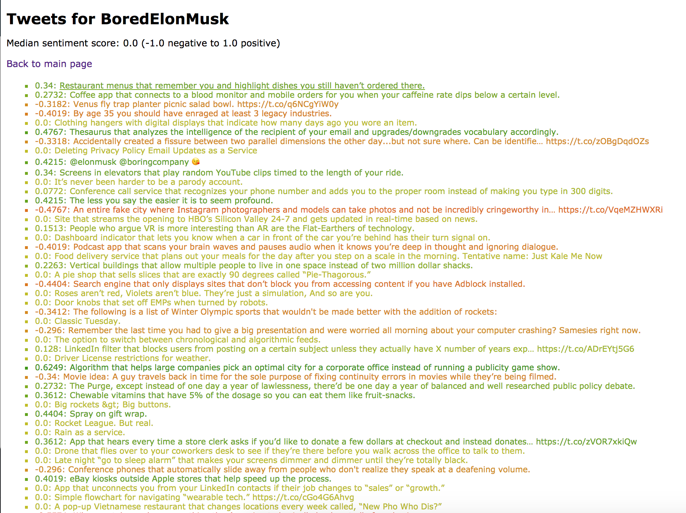

# Project Introduction
In the `Twitter Sentiment Analysis` project, we retrieved tweets via the tweepy API and visualized sentiment with a color gradient using Python. We also extracted user profile information (picture, name, number of followers, date joined) by parsing HTML on Twitter profile page.

See what [bored Elon Musk](https://twitter.com/BoredElonMusk) tweets about!

# How it works
This toy example works as follows:
+ Scrape data from Twitter
+ Parse tweets to remove random stuff
+ Calculate the sentiment via the [vaderSentiment](https://github.com/cjhutto/vaderSentiment) package
+ Visualize the sentiment from Red (-1: very negative) to Green (+1: very positive)
